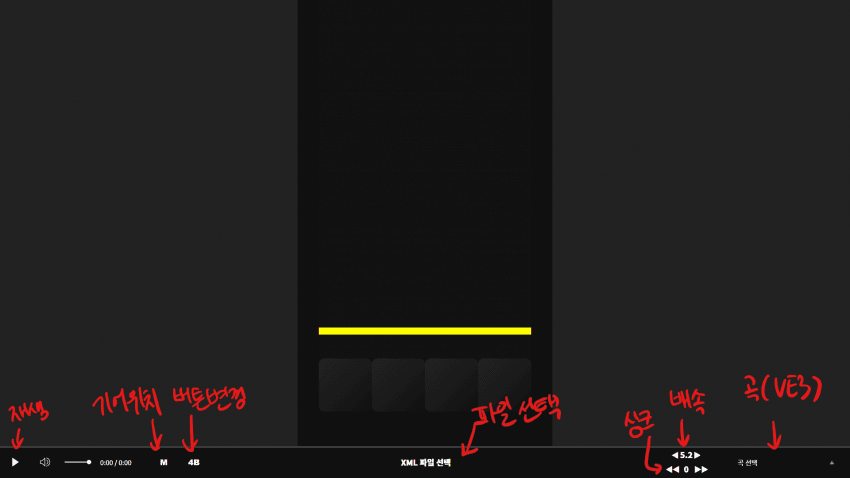

# DPCtester

해당 페이지는 DJMAX RESPECT V의 공식 페이지가 아니며, 리듬 게임 DJMAX RESPECT V의 팬사이트입니다.
DJMAX RESPECT V은 NEOWIZ의 등록상표입니다.

xml 파일을 시뮬레이션 하기 위해 만들어졌습니다.

https://obinox.github.io/DPCtester

1. XML 파일 업로드
2. 곡 선택
3. 버튼 수 맞춰놓고 재생
4. 싱크 테스트하며서 맞추기/편한 배속으로 조절하기

-   ESC/Space/K: 재생/일시정지
-   J/L: 10초 전/후
-   왼쪽/오른쪽 화살표: 5초 전/후
-   1/2: 배속 변경
-   4/5/6/8: 키 바로 변경
